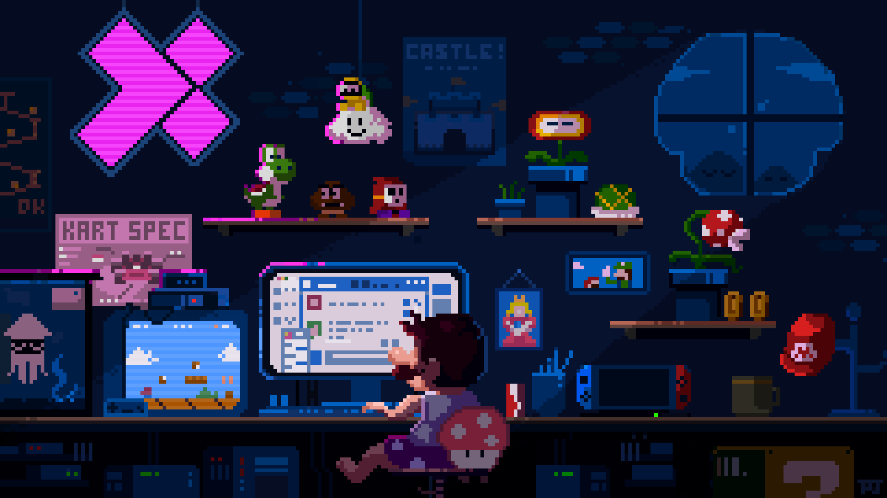

<h1 align="center">Hi, I'm Muhammad Aziiz Trinaldi 👋</h1>

  Informatics student at <b>Universitas Tanjungpura</b>, Pontianak. 
  I like building things I actually use, from small web tools to hardware that talks to the internet.

  

  
  
  

### Right now I'm
- Training for a competitive programming contest (C++, lots of Codeforces)
- Building a fingerprint smart door lock with my team for our Embedded Systems class
- Learning more about cryptography, cybersecurity, AI, Machine Learning, and Natural Language Processing

### Tools I use

  

  

### Projects

<table>
  <tr>
    <td width="50%" valign="top">
      <h3><a href="https://github.com/AziizTrinaldi/Hunter-System">⚔️ Hunter System</a></h3>
      
My study sessions turned into an RPG. I kept losing focus, so I made a Pomodoro timer where every session earns XP, gold and gear, gates appear on a city map, and skipping my daily target gets me a penalty. Inspired by <i>Solo Leveling</i>.

      
      
      
    </td>
    <td width="50%" valign="top">
      <h3><a href="https://github.com/AziizTrinaldi/Smart-Door-Lock">🔒 Smart Door Lock</a></h3>
      
Team project for Embedded Systems. An ESP32 door lock with a fingerprint sensor and an ultrasonic sensor, plus a web dashboard to see who came in and manage access.

      
      
      
    </td>
  </tr>
  <tr>
    <td width="50%" valign="top">
      <h3><a href="https://github.com/AziizTrinaldi/SingkawangKu">🏮 SingkawangKu</a></h3>
      
A tourism website for Singkawang that introduces the city and the places worth visiting, from food spots to landmarks.

      
      
      
    </td>
    <td width="50%" valign="middle" align="center">
      
<b>Next quest loading…</b>

      
More projects from class, contests and side experiments.

      
    </td>
  </tr>
</table>

### Organizations

<table>
  <tr>
    <td width="90" align="center" valign="middle">
      
    </td>
    <td valign="top">
      <b>AIESEC in UNTAN</b> · Staff of Talent Development & Experience · <i>2026 – present</i>
      <ul>
        <li>Managed social media for @aktjaya.locus: planned content and designed posts</li>
        <li>Built and maintained the Aktjaya Library website using WordPress</li>
      </ul>
      
      
      
    </td>
  </tr>
  <tr>
    <td width="90" align="center" valign="middle">
      
    </td>
    <td valign="top">
      <b>Himpunan Mahasiswa Informatika UNTAN</b> · Vice Head of Organizational Development · <i>2026 – present</i>
      <ul>
        <li>Help lead the division that handles the association's internal affairs, keeping members engaged and the organization running well</li>
        <li>Run internal programs such as member data analysis, internal training, an anonymous feedback form and an education program</li>
      </ul>
      
      
      
    </td>
  </tr>
  <tr>
    <td width="90" align="center" valign="middle">
      
    </td>
    <td valign="top">
      <b>ARISE</b> · Competitive Programming Study Club, Universitas Tanjungpura · Treasurer · <i>2024 – 2025</i>
      <ul>
        <li>Manage the club's finances as treasurer</li>
        <li>Write practice problems and explain algorithm topics to members during study sessions</li>
      </ul>
      
      
      
      
    </td>
  </tr>
</table>

### Contributions

  <picture>
    <source media="(prefers-color-scheme: dark)" srcset="https://raw.githubusercontent.com/AziizTrinaldi/AziizTrinaldi/output/pacman-contribution-graph-dark.svg">
    <source media="(prefers-color-scheme: light)" srcset="https://raw.githubusercontent.com/AziizTrinaldi/AziizTrinaldi/output/pacman-contribution-graph.svg">
    
  </picture>

  
  

  

